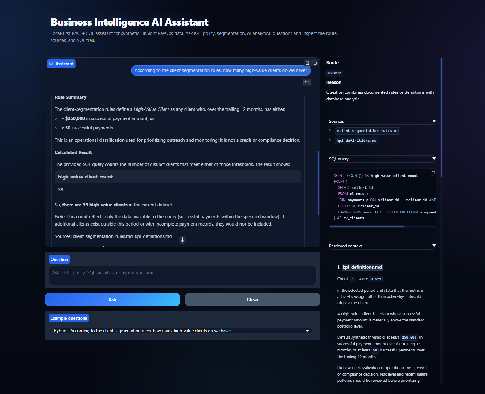
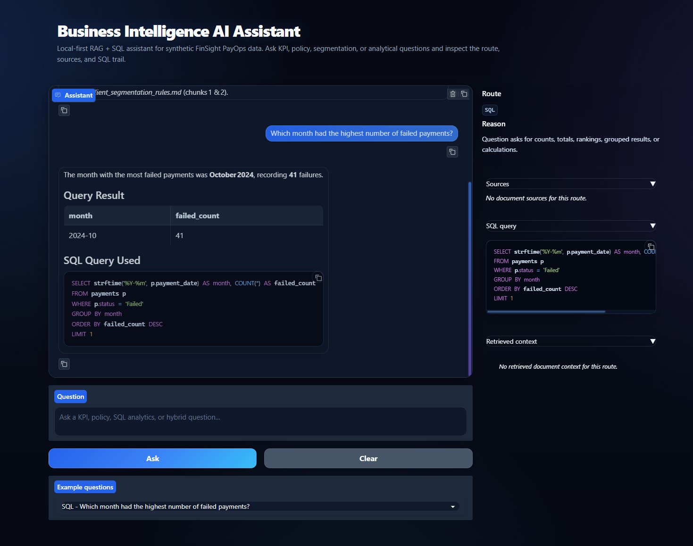
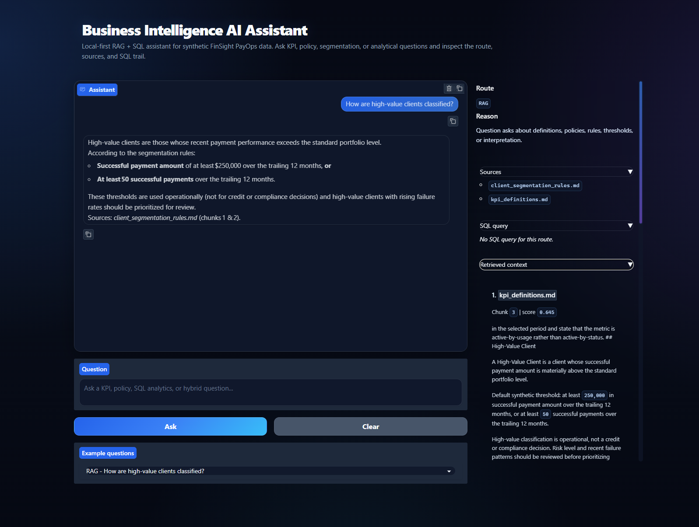
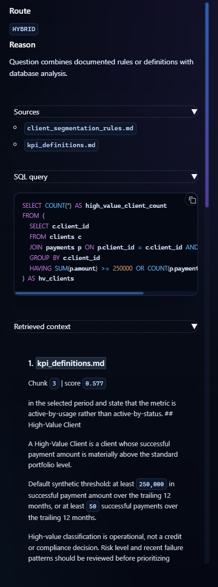

# Business Intelligence AI Assistant

Local-first RAG + SQL business intelligence assistant for synthetic payment operations data.

## Summary

Business Intelligence AI Assistant is a portfolio project that demonstrates how a local LLM can answer business questions by combining document retrieval, safe SQL generation, and route-aware answer synthesis. The fictional domain is FinSight PayOps, a synthetic payment operations company with generated clients, providers, payments, KPI definitions, policy notes, and client segmentation rules.

The app runs locally with an OpenAI-compatible model server such as LM Studio. It does not require private data or external SaaS services for the core demo.

## Overview

The assistant answers three kinds of questions:

- **RAG:** document-only questions about KPI definitions, policies, and segmentation rules.
- **SQL:** analytical questions over a local SQLite database.
- **Hybrid:** questions that need a documented rule plus a database calculation.

The Gradio UI shows the final answer, selected route, route reason, document sources, generated SQL, and retrieved document context.

The React UI provides a polished dashboard experience with the same transparency: route metadata, generated SQL, sources, and retrieved context.

## Demo

Run the local demo:

```powershell
python scripts/ingest_documents.py
python -m app.main
```

Then open:

```text
http://127.0.0.1:7860
```

Make sure LM Studio or another OpenAI-compatible local server is running first.

## Screenshots

### Hybrid Answer: RAG + SQL



### SQL Analytics Answer



### Document RAG Answer



### Answer Trace



## Key Features

- Local-first OpenAI-compatible LLM client.
- Synthetic payment operations dataset with 500 clients, 20 providers, and 10,000 payments.
- SQLite analytics database with foreign keys and safe read-only execution.
- Markdown document RAG over KPI definitions, payment operations policy, and segmentation rules.
- Persistent ChromaDB vector store using `all-MiniLM-L6-v2` embeddings.
- Rule-based question router for RAG, SQL, and Hybrid paths.
- SQL validation that blocks non-SELECT statements, comments, semicolons, and dangerous keywords.
- Gradio demo UI with route trace, SQL trace, sources, and retrieved context.
- Pytest coverage for config-adjacent helpers, RAG chunking, SQL validation/execution, router dispatch, and UI formatting helpers.

## Architecture

```text
User Question
  -> Assistant Router
  -> Route Decision: RAG / SQL / Hybrid
  -> Document RAG Pipeline and/or SQL Agent
  -> Retrieved Context and/or SQL Result
  -> Local LLM Answer Synthesis
  -> Final Answer + Sources + SQL Trace
```

Core modules:

- `app/router.py`: deterministic route selection and answer dispatch.
- `app/rag.py`: document loading, chunking, embeddings, ChromaDB retrieval, and grounded document answers.
- `app/sql_agent.py`: schema extraction, SQL generation, validation, read-only execution, and result summaries.
- `app/llm_client.py`: OpenAI-compatible local LLM wrapper.
- `app/main.py`: Gradio demo UI.

## How It Works

1. Synthetic markdown documents are loaded from `data/documents/`.
2. `scripts/ingest_documents.py` chunks those documents and stores embeddings in `vector_store/`.
3. Synthetic payment operations data is stored in `data/business_data.sqlite`.
4. The router classifies each question as `rag`, `sql`, or `hybrid`.
5. RAG questions retrieve document chunks and ask the LLM to answer only from that context.
6. SQL questions generate a SQLite `SELECT`, validate it, execute it, and display deterministic result tables.
7. Hybrid questions retrieve document context, use that context to guide SQL generation, execute the validated query, and synthesize the final answer from both sources.

## Example Questions

### RAG

- What is payment success rate?
- How are failed payments reviewed?
- How are high-value clients classified?
- What counts as abnormal payment behavior?
- How should reversed payments be interpreted?

### SQL

- Show total payment amount by provider.
- Which month had the highest number of failed payments?
- List the top 10 clients by total payment amount.
- Show payment success rate by provider.
- How many active clients are there by region?

### Hybrid

- Using the KPI definition, calculate the payment success rate from the database.
- According to the client segmentation rules, how many high-value clients do we have?
- Based on the provider failure-rate threshold in the policy, which providers should be reviewed?
- Based on the segmentation rules, how many clients appear low-value, standard, high-value, and strategic?
- Which high-value clients have elevated failure rates and should be prioritized for review?

## Tech Stack

- Python
- Gradio
- SQLite
- pandas
- OpenAI Python SDK
- python-dotenv
- sentence-transformers
- ChromaDB
- pytest

## Project Structure

```text
app/
  config.py            # environment configuration
  llm_client.py        # OpenAI-compatible local LLM client
  rag.py               # document RAG pipeline
  sql_agent.py         # safe SQL agent
  router.py            # RAG / SQL / Hybrid router
  main.py              # Gradio UI
data/
  documents/           # synthetic markdown knowledge base
  raw/                 # generated synthetic CSV data
  processed/           # reserved for processed data artifacts
  business_data.sqlite # local synthetic SQLite database
docs/
  architecture.md
  data_dictionary.md
  demo_questions.md
  limitations.md
  prompt_design.md
scripts/
  generate_synthetic_data.py
  build_database.py
  ingest_documents.py
  test_llm_connection.py
  test_rag_query.py
  test_sql_agent.py
  demo_router.py
tests/
  test_*.py
vector_store/
  .gitkeep             # generated ChromaDB files are ignored
```

## Setup

Create and activate a virtual environment:

```powershell
python -m venv .venv
.\.venv\Scripts\Activate.ps1
```

Install dependencies:

```powershell
pip install -r requirements.txt
```

Create a local environment file:

```powershell
Copy-Item .env.example .env
```

Example LM Studio-compatible settings:

```text
LLM_BASE_URL=http://localhost:1234/v1
LLM_API_KEY=lm-studio
LLM_MODEL=your-loaded-model-id
DATABASE_PATH=data/business_data.sqlite
VECTOR_STORE_PATH=vector_store
```

Do not commit `.env`.

## Generate Data And Build The Database

```powershell
python scripts/generate_synthetic_data.py
python scripts/build_database.py
```

The database is written to `data/business_data.sqlite`.

## Run Document Ingestion

```powershell
python scripts/ingest_documents.py
```

This creates or refreshes the local ChromaDB index under `vector_store/`.

## Run The Gradio App

Start LM Studio's local server, then run:

```powershell
python -m app.main
```

Open:

```text
http://127.0.0.1:7860
```

Gradio remains the lightweight local demo and fallback interface.

## React UI

The React UI is the polished portfolio interface and uses a FastAPI backend bridge to the same `AssistantRouter`.

### Backend (FastAPI)

Run the API server from the project root:

```powershell
python -m backend.api
```

or:

```powershell
uvicorn backend.api:app --reload --port 8000
```

Health check endpoint:

```text
GET http://127.0.0.1:8000/health
```

Chat endpoint:

```text
POST http://127.0.0.1:8000/chat
```

### Frontend (React + Vite)

```powershell
cd frontend
npm install
npm run dev
```

Then open:

```text
http://127.0.0.1:5173
```

Set frontend API URL with:

```text
VITE_API_BASE_URL=http://localhost:8000
```

Use `frontend/.env.example` as a template and do not commit `frontend/.env`.

Make sure LM Studio (or another OpenAI-compatible local LLM server) is running before asking questions from either UI.

## Run Tests

```powershell
python -m pytest tests
```

The tests do not require a real local LLM server. LLM-dependent behavior is mocked where appropriate.

## Safety And Grounding Strategy

- RAG answers are instructed to use only retrieved document context.
- SQL generation is schema-grounded with table names, columns, relationships, and categorical examples.
- SQL execution is read-only and validates generated SQL before execution.
- The SQL validator rejects multiple statements, comments, semicolons, and dangerous keywords such as `DROP`, `DELETE`, `UPDATE`, `INSERT`, `ALTER`, `CREATE`, `REPLACE`, `TRUNCATE`, `PRAGMA`, `ATTACH`, `DETACH`, and `VACUUM`.
- SQL result tables are rendered deterministically from pandas instead of relying on the LLM to format tabular output.
- Hybrid answers combine retrieved document context with validated SQL results and include sources plus SQL trace.

## Limitations

- The dataset is synthetic and does not represent real payment operations.
- Local LLM quality depends on the selected model, quantization, and prompt-following ability.
- SQL generation is constrained and validated, but still requires evaluation before production use.
- The app has no authentication, authorization, monitoring, or audit logging.
- The vector store must be rebuilt after document changes.
- The UI is a local demo, not a hardened production BI application.

## Future Improvements

- Add a richer evaluation suite for routing, SQL generation, and grounded answer quality.
- Add authentication and user-level audit logs.
- Add configurable date windows and currency handling.
- Add chart rendering for common SQL results.
- Add more synthetic operational tables such as refunds, chargebacks, settlements, and provider incidents.
- Add prompt and retrieval regression tests for the document corpus.
- Package the app with Docker for repeatable local demos.
